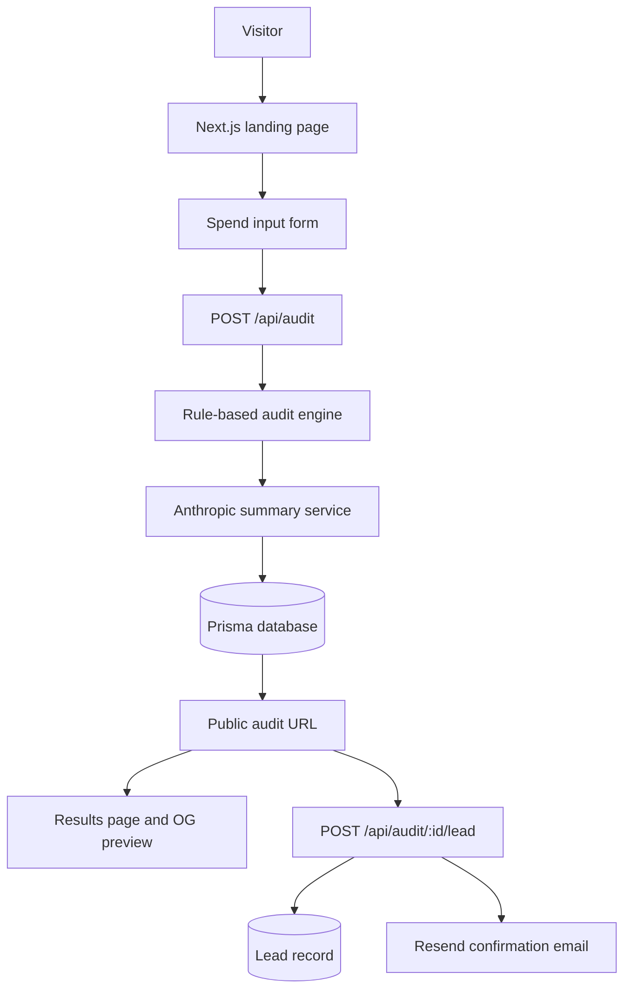

# Architecture

## System Diagram

## Data Flow

The user enters team size, use case, tool, plan, seats, and spend. The client posts an anonymous audit payload to `/api/audit`, which validates the request with Zod and passes spend items to `runAudit`. The engine checks plan fit, unused seats, alternative tools, API migration opportunities, overlapping tools, and high-spend credit opportunities. The resulting audit is summarized through Anthropic when available, persisted with Prisma, cached in `localStorage`, and shown at `/audit/[id]`.

Email capture happens after the report is visible. The results page posts to `/api/audit/[id]/lead`, which attaches the lead to the audit and sends a Resend confirmation when configured.

## Stack Choice

Next.js keeps the product compact: React UI, API endpoints, dynamic metadata, and generated Open Graph images live in one deployable app. TypeScript keeps audit inputs and result shapes explicit. Prisma gives a clean local database abstraction that can move to Postgres later.

## 10k Audits Per Day

Move from SQLite to managed Postgres, add request rate limiting at the edge, queue email delivery, and make AI summary generation asynchronous so audit math remains instant. Cache public audit pages and OG image generation by audit ID. Add structured logging, error tracking, and a pricing data update job with review before production rollout.
