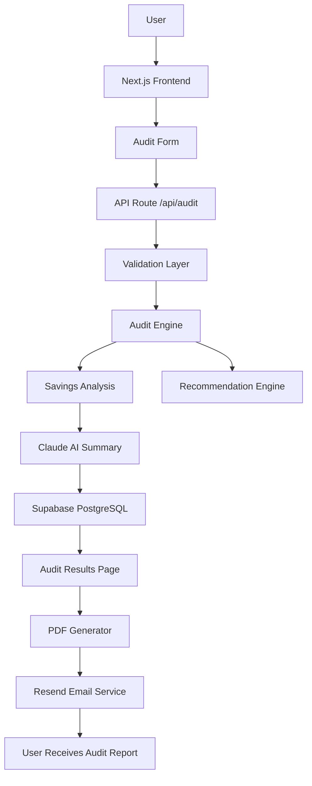

## 🏗️ System Architecture

---

## 🔄 Data Flow

1. The user enters their AI tools, subscription plans, team size, and monthly spend through the audit form.

2. The frontend sends the data to the `/api/audit` route where input validation is handled using TypeScript schemas.

3. The audit engine analyzes:
   - overlapping subscriptions,
   - unused seats,
   - oversized plans,
   - API vs subscription opportunities,
   - cheaper alternatives.

4. The calculated results are passed to the Anthropic Claude API to generate a human-readable executive summary.

5. Final audit data is stored in Supabase PostgreSQL using Prisma ORM.

6. The application generates:
   - a shareable audit results page,
   - downloadable PDF reports,
   - email delivery using Resend.

7. The user receives optimization recommendations and estimated savings opportunities.

---

## ⚙️ Why I Chose This Stack

### Next.js
I chose Next.js because it provides full-stack capabilities with server actions, API routes, routing, and optimized production deployment in a single framework.

### TypeScript
TypeScript improves maintainability and prevents runtime errors through strict typing across the application.

### Supabase PostgreSQL
Supabase provides a scalable PostgreSQL database with excellent developer experience, relational querying, and production-ready infrastructure.

### Prisma ORM
Prisma simplifies database operations while maintaining strong type safety and clean schema management.

### Tailwind CSS
Tailwind enabled rapid UI development and consistent responsive design without writing large custom CSS files.

### Anthropic Claude API
Claude generates professional and readable audit summaries while the core financial logic remains deterministic.

### Resend
Resend provides a modern and developer-friendly email API for sending audit reports and notifications reliably.

### Vercel
Vercel offers fast deployment, edge optimization, and seamless integration with Next.js applications.

---

## 🚀 What I Would Change for 10k Audits/Day

### 1. Move Heavy Tasks to Background Workers
PDF generation and email delivery would be handled asynchronously using queues like BullMQ, Inngest, or Trigger.dev.

### 2. Add Redis Caching
Frequently accessed pricing data and audit templates would be cached using Redis to reduce database and API load.

### 3. Separate AI Services into Dedicated Workers
Claude summary generation would run in isolated worker services to avoid blocking API requests.

### 4. Introduce Rate Limiting and Monitoring
I would add:
- API rate limiting,
- structured logging,
- monitoring tools like PostHog or Sentry,
- request analytics.

### 5. Database Optimization
Supabase PostgreSQL would be optimized with:
- indexing,
- read replicas,
- connection pooling,
- partitioned audit tables.

### 6. CDN and Edge Optimization
Static assets and audit result pages would be cached at the edge using CDN strategies for lower latency.

### 7. Event-Driven Architecture
The system would evolve into a more event-driven architecture where:
- audits,
- emails,
- analytics,
- report generation

operate independently through queues and background jobs.