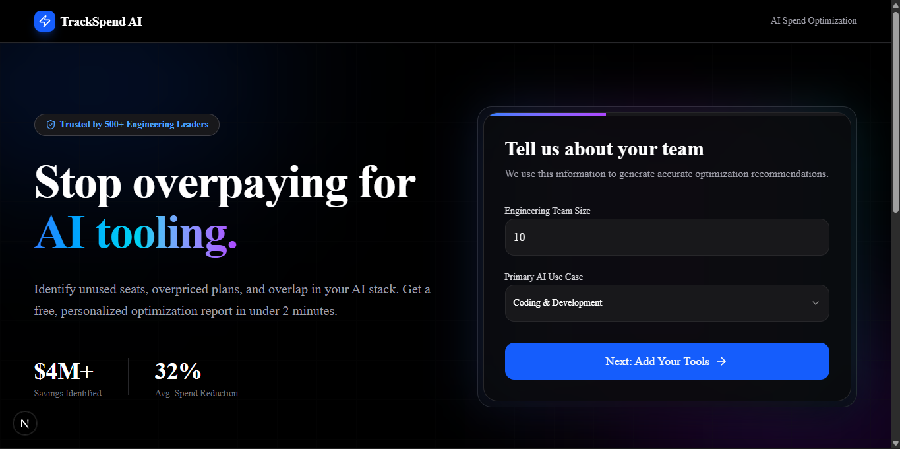
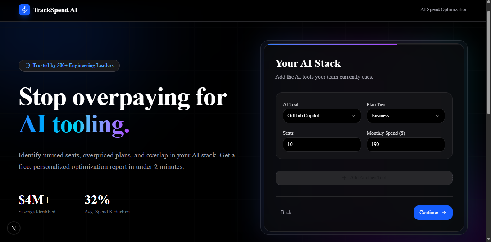
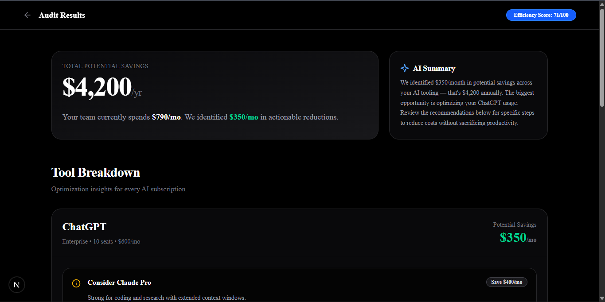

# TrackSpend AI

TrackSpend AI is an AI subscription audit platform built for startups, indie hackers, and engineering teams to analyze and optimize spending across tools like ChatGPT, Claude, GitHub Copilot, and Windsurf. The platform identifies overlapping subscriptions, unused seats, and cost-saving opportunities while generating AI-powered audit summaries and downloadable PDF reports.

## 🚀 Deployed URL

https://your-deployed-url.vercel.app

---

## 📸 Screenshots

### Landing Page


### Audit Form


### Audit Results Dashboard


---


## ⚡ Quick Start

### Clone Repository

```bash
git clone https://github.com/yourusername/trackspend-ai.git
cd trackspend-ai
```

### Install Dependencies

```bash
npm install
```

### Configure Environment Variables

Create a `.env.local` file:

```env
DATABASE_URL=
DIRECT_URL=

ANTHROPIC_API_KEY=
RESEND_API_KEY=

NEXT_PUBLIC_APP_URL=http://localhost:3000
```

### Run Database Migrations

```bash
npx prisma migrate dev
```

### Start Development Server

```bash
npm run dev
```

Open:

```text
http://localhost:3000
```

---

## 🚀 Deploy

Deploy easily using Vercel:

1. Push project to GitHub
2. Import repository into Vercel
3. Add environment variables
4. Deploy

---

## ⚖️ Decisions & Trade-offs

### 1. Rule-Based Audit Engine Instead of Fully AI-Generated Decisions
I used deterministic business logic for financial recommendations to ensure reliable and predictable savings calculations.

### 2. Anonymous Audits Instead of Mandatory Authentication
Users can complete audits without creating accounts to reduce friction and improve completion rates.

### 3. Supabase PostgreSQL Instead of SQLite
I migrated from SQLite to Supabase PostgreSQL for better scalability, relational querying, and production readiness.

### 4. Claude Used Only for Summaries
Anthropic Claude generates human-readable executive summaries while the actual optimization logic remains rule-based for consistency.

### 5. Server-Side PDF Generation
PDF reports are generated server-side to maintain consistent formatting and simplify email delivery workflows.